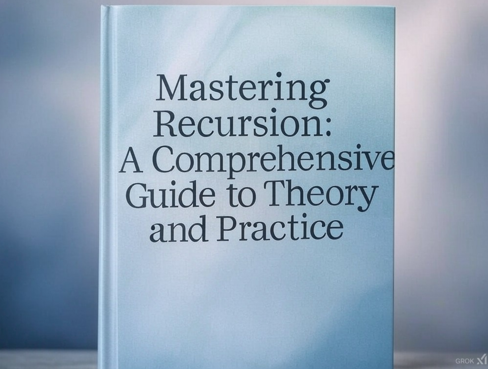

# 深入递归：理论与实践的结合

>这是一本Shizheng Li借助GPT 4o生成的书。

## 封面

使用Grok 2生成

------

## **第一章：递归的基本概念与理论**

### 1.1 什么是递归

- 递归的定义及特点
- 递归与迭代的区别与联系
- 递归的基本模型：数学归纳法与计算模型

### 1.2 数学中的递归

- 数列递归的理论基础
- 递归与组合数学
- 数学归纳法的递归逻辑推导

### 1.3 计算机科学中的递归

- 栈的原理及递归调用栈
- 递归的时空复杂度分析
- 编译器对递归的优化：尾递归优化

------

## **第二章：递归的实际应用**

### 2.1 排序与搜索算法中的递归

- 快速排序的递归结构
- 二分搜索及其递归实现
- 树状结构的递归遍历（深度优先搜索与后序遍历）

### 2.2 数据结构中的递归

- 链表反转：递归与迭代的对比
- 树与图的递归操作
- 动态规划中的递归思想

### 2.3 自然语言处理中的递归

- 句法树解析的递归实现
- NLP 中的分层注意力机制与递归
- 开源项目示例：PyTorch 中的递归神经网络（RNN）模块

------

## **第三章：复杂问题的递归解法**

### 3.1 动态规划中的递归优化

- 背包问题中的递归拆分
- 开源项目示例：PyTorch 中的动态规划实现
- 缓存与备忘录递归的结合（Memoization）

### 3.2 字符串处理中的递归

- 字符串匹配的递归算法
- 正则表达式引擎中的递归
- 开源项目示例：Lucene 全文搜索库中的递归模块

### 3.3 自然语言处理中的递归

- 树形结构嵌入的递归实现
- Transformer 模型中的递归模式
- 开源项目示例：Hugging Face 的 NLP 模型中的递归组件

------

## **第四章：递归在高性能计算中的优化**

### 4.1 分治算法中的递归

- 大数乘法：分治与递归的结合
- 矩阵快速幂的递归优化

### 4.2 并行计算中的递归

- PyTorch 中的递归与分布式计算
- OpenMP 与递归结合的并行化
- 开源项目示例：Apache Spark 中的递归操作

### 4.3 尾递归与其在现代语言中的实现

- 如何手动优化尾递归
- Python 与尾递归的实现差异
- Java 和 C++ 中尾递归优化案例

------

## **第五章：递归中的挑战与错误处理**

### 5.1 深度与性能问题

- 递归深度限制及其解决方案
- 栈溢出与递归设计中的边界问题

### 5.2 调试递归程序

- 递归程序的可视化调试技巧
- 单元测试与递归验证

### 5.3 递归中的错误示例与案例分析

- 常见递归错误的分析与改进
- 开源项目中递归 Bug 的案例研究

------

## **第六章：递归的未来：理论与实践的结合**

### 6.1 递归与人工智能

- 递归神经网络（RNN）的原理与应用
- 强化学习中的递归决策模型

### 6.2 递归与量子计算

- 量子递归算法初探
- 递归在量子图灵机中的应用

### 6.3 实验与未来展望

- 对递归算法的改进方向
- 理论递归与实际应用的结合潜力

------

## **附录**

- Python、C++、Java代码示例汇总
- 开源项目案例的详细实现与分析
- 常见问题与解决方案

# Mastering Recursion: A Comprehensive Guide to Theory and Practice

------

## Chapter 1: Fundamentals of Recursion

### 1.1 What is Recursion?

- Definition and characteristics of recursion
- Differences and connections between recursion and iteration
- The basic model of recursion: mathematical induction and computational models

### 1.2 Recursion in Mathematics

- Theoretical foundation of recursive sequences
- Recursion in combinatorics
- Logical derivation of recursion through mathematical induction

### 1.3 Recursion in Computer Science

- Call stack principles and recursive function calls
- Time and space complexity analysis of recursion
- Compiler optimizations for recursion: tail call optimization

------

## Chapter 2: Practical Applications of Recursion

### 2.1 Recursion in Sorting and Searching Algorithms

- Recursive structure of quicksort
- Binary search and its recursive implementation
- Recursive tree traversal: depth-first search and post-order traversal

### 2.2 Recursion in Data Structures

- Recursive reversal of linked lists: comparison with iteration
- Recursive operations in trees and graphs
- Dynamic programming with recursive thinking

### 2.3 Recursion in Natural Language Processing

- Recursive implementation of syntax tree parsing
- Recursive mechanisms in hierarchical attention
- Open-source example: Recursive Neural Networks (RNN) in PyTorch

------

## Chapter 3: Solving Complex Problems with Recursion

### 3.1 Recursive Optimization in Dynamic Programming

- Recursive decomposition in the knapsack problem
- Open-source example: Implementing dynamic programming in PyTorch
- Combining memoization with recursive solutions

### 3.2 Recursion in String Processing

- Recursive algorithms for string matching
- Recursion in regular expression engines
- Open-source example: Recursive modules in the Lucene full-text search library

### 3.3 Recursion in NLP

- Recursive implementation for tree-structured embeddings
- Recursive patterns in Transformer models
- Open-source example: Recursive components in Hugging Face NLP models

------

## Chapter 4: Optimizing Recursion for High-Performance Computing

### 4.1 Recursion in Divide-and-Conquer Algorithms

- Combining recursion and divide-and-conquer in large number multiplication
- Recursive optimization in matrix exponentiation

### 4.2 Recursion in Parallel Computing

- Recursive implementations in distributed computing with PyTorch
- Integrating recursion and OpenMP for parallelism
- Open-source example: Recursive operations in Apache Spark

### 4.3 Tail Recursion and Its Modern Implementations

- Manual optimization techniques for tail recursion
- Differences in tail recursion implementations in Python
- Case studies of tail recursion optimization in Java and C++

------

## Chapter 5: Challenges and Debugging in Recursive Programming

### 5.1 Depth and Performance Challenges

- Limitations of recursion depth and their solutions
- Stack overflow and boundary considerations in recursive design

### 5.2 Debugging Recursive Programs

- Visualizing recursion for debugging
- Unit testing and validation of recursive functions

### 5.3 Case Studies of Recursive Errors

- Analysis and improvements of common recursive mistakes
- Case studies of bugs related to recursion in open-source projects

------

## Chapter 6: The Future of Recursion: Bridging Theory and Practice

### 6.1 Recursion in Artificial Intelligence

- Principles and applications of recursive neural networks (RNNs)
- Recursive decision models in reinforcement learning

### 6.2 Recursion in Quantum Computing

- Introduction to quantum recursive algorithms
- Applications of recursion in quantum Turing machines

### 6.3 Experiments and Future Prospects

- Directions for improving recursive algorithms
- Potential in bridging theoretical recursion and practical applications

------

## **Appendices**

- Python, C++, and Java code examples
- Detailed implementation and analysis of open-source project cases
- Frequently asked questions and solutions

------

