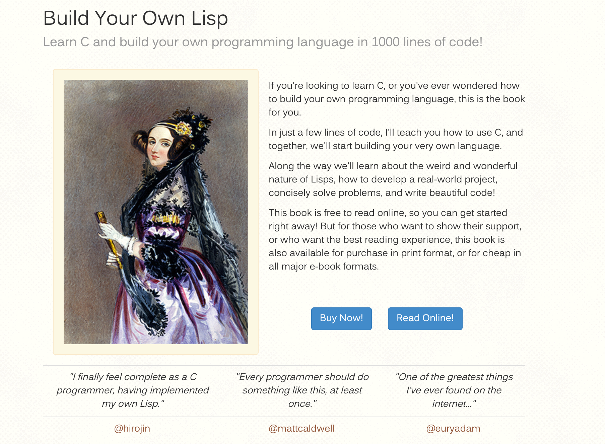

# Build Your Own Lisp

Learn C and build your own programming language in 1000 lines of code!

Link: [https://www.buildyourownlisp.com/](https://www.buildyourownlisp.com/)

Source code: [https://github.com/orangeduck/BuildYourOwnLisp/tree/master/src](https://github.com/orangeduck/BuildYourOwnLisp/tree/master/src)

## Contents

Learning notes in Mandarin.

